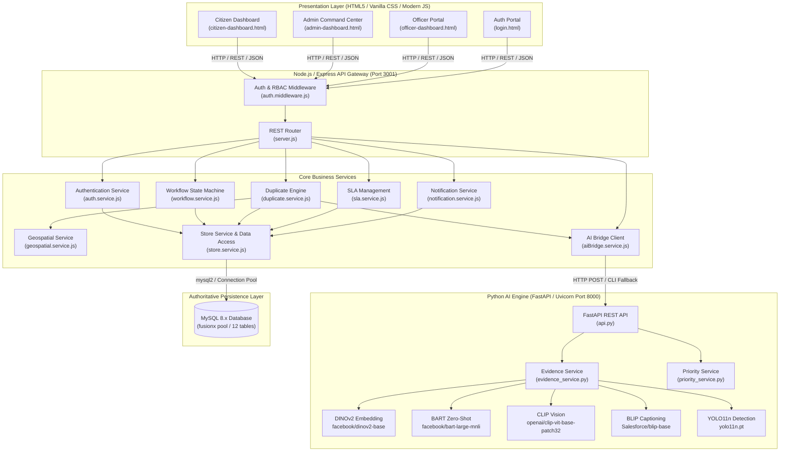
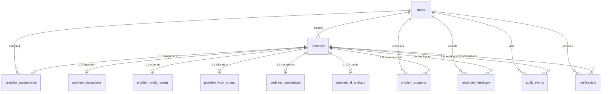

# FUSIONX 1.0

**AI-Based Community Problem Detection, Clustering, and Solution Prioritization System**

> Transform scattered civic complaints into verified community problems, prioritize them based on impact, and connect citizens, civic officers, and administrators through a complete resolution workflow.

---

### Core Innovation: *"Don't count complaints. Measure the real community problem."*

Traditional civic reporting platforms treat every submitted ticket as an isolated complaint. When fifty citizens report a burst water main or an impassable roadway pothole, civic authorities receive fifty disconnected grievances—leading to ticket duplication, administrative bottlenecks, miscalculated urgency, and delayed intervention. 

**FUSIONX 1.0** fundamentally redefines civic governance:
1. **Location-First & Visual Verification:** Instead of filing redundant tickets, citizens discovering an issue are guided by geospatial proximity ($r = 100\text{ m}$) and computer vision image similarity to endorse existing issues with **"I'm Affected"** support.
2. **Multimodal AI Evidence Analysis:** Submissions undergo automated cross-modal verification using pre-trained deep learning models from Hugging Face (DINOv2, BART, CLIP, BLIP, and YOLO).
3. **Dynamic Priority Scoring:** A transparent mathematical engine computes urgency based on field-verified severity, multimodal evidence strength, citizen endorsements, infrastructure criticality, unresolved duration, and community growth.
4. **End-to-End Governance Lifecycle:** A complete 14-state civic workflow coordinates citizens, field inspection officers, and municipal administrators through on-site verification, work orders, completion validation, and citizen re-opening rights.
5. **Authoritative Persistence:** All transactions, entity aggregates, and audit logs persist reliably in a 12-table relational MySQL database.

---

## Table of Contents

- [1. Problem Statement](#1-problem-statement)
- [2. Proposed Solution](#2-proposed-solution)
- [3. Key Features](#3-key-features)
- [4. AI Integration & Hugging Face Models](#4-ai-integration--hugging-face-models)
- [5. Technical Architecture](#5-technical-architecture)
- [6. Complete Civic Workflow Lifecycle](#6-complete-civic-workflow-lifecycle)
- [7. Priority Engine](#7-priority-engine)
- [8. Multimodal Evidence Analysis](#8-multimodal-evidence-analysis)
- [9. Geospatial & Visual Duplicate Detection](#9-geospatial--visual-duplicate-detection)
- [10. Technology Stack](#10-technology-stack)
- [11. Database Architecture](#11-database-architecture)
- [12. Authentication & Authorization](#12-authentication--authorization)
- [13. Comprehensive API Reference](#13-comprehensive-api-reference)
- [14. Security & Data Protection](#14-security--data-protection)
- [15. Database Persistence & Reliability](#15-database-persistence--reliability)
- [16. Testing & Validation Results](#16-testing--validation-results)
- [17. Project Structure](#17-project-structure)
- [18. Installation & Setup](#18-installation--setup)
- [19. Running the Application](#19-running-the-application)
- [20. Environment Variables & Configuration](#20-environment-variables--configuration)
- [21. Innovation & Value Proposition](#21-innovation--value-proposition)
- [22. Future Enhancements](#22-future-enhancements)
- [23. System Demo & UI Walkthrough](#23-system-demo--ui-walkthrough)
- [24. Team & Credits](#24-team--credits)
- [25. License](#25-license)

---

## 1. Problem Statement

Modern municipal administrations struggle with reactive, fragmented citizen complaint portals:

* **Fragmented Individual Reporting:** Citizens report neighborhood breakdowns (potholes, garbage dumps, burst pipelines, non-functional streetlights) individually without awareness of neighboring reports.
* **Redundant Complaint Storms:** A single localized disruption results in dozens of identical complaints filed under disparate categories, overwhelming municipal dispatchers.
* **Invisible Community Impact:** Complaint portals track ticket volumes rather than the geographic density or population affected. Critical systemic failures impacting hundreds can rank lower than isolated minor complaints.
* **Lack of Multi-Tier Verification:** False reports, duplicate spam, or outdated photos drain public department inspection budgets without objective evidence checks.
* **Broken Resolution Loops:** Problems are frequently marked "Closed" in municipal administrative software without objective on-site photographic proof or citizen satisfaction confirmation.

---

## 2. Proposed Solution

FUSIONX 1.0 shifts the paradigm from individual complaint management to collective community problem resolution:

```
Citizen Report ──► Location & Duplicate Check ──► Existing Issue Detected?
                            │                              │
                            ▼ (No)                         ▼ (Yes)
                   AI Evidence Analysis            Citizen Clicks "I'm Affected"
                            │                              │
                            ▼                              ▼
                   Dynamic Priority Engine ◄──── Recalculate Urgency Score
                            │
                            ▼
                   Admin Review & Officer Assignment
                            │
                            ▼
                   On-Site Officer Field Inspection & Severity Assessment
                            │
                            ▼
                   Work Estimation & Admin Work Order Allocation
                            │
                            ▼
                   Physical Work Execution (STARTED ──► IN_PROGRESS ──► COMPLETED)
                            │
                            ▼
                   Officer Photographic Completion Verification
                            │
                            ▼
                   Admin Final Verification & Closure (RESOLVED)
                            │
                            ▼
                   Citizen Feedback Loop (Satisfied vs. REOPENED)
```

### The Core Principle
> **"Don't count complaints. Measure the real community problem."**

When a citizen begins reporting an issue, FUSIONX checks the coordinates and photo against active problems within 100 meters. If a matching issue is discovered:
- The citizen is presented with the existing problem and invited to endorse it via **"I'm Affected"** rather than creating a duplicate ticket.
- Supporting citizens can provide supplemental photos, notes, and exact coordinates.
- Each endorsement automatically increments community backing and dynamically updates the problem's Priority Score in the administrative queue.
- Duplicate issues are avoided at the source without auto-closing or dismissing citizen voices.

---

## 3. Key Features

### 👤 Citizen Capabilities
* **Interactive Problem Reporting:** Capture civic issues with title, description, category, and photo attachments.
* **High-Accuracy Geolocation:** Automatic GPS acquisition via Browser Geolocation API with interactive map placement.
* **Pre-Submission Duplicate Warning:** Real-time geospatial + visual similarity evaluation alerts users before duplicate submission.
* **"I'm Affected" Community Support:** Endorse existing nearby problems with optional notes and photos to amplify collective voice without creating redundant tickets.
* **Personal Civic Tracking:** Dedicated views for *"My Reported Issues"* and *"Issues I Supported"* with public status progression.
* **Voice-to-Text Input:** Built-in Web Speech API (`SpeechRecognition`) for hands-free voice notes supporting Indian English and regional locales.
* **Multilingual Interface:** Instant localized UI toggles between English (`en`), Tamil (`ta`), and Hindi (`hi`).
* **In-App AI Assistant:** Conversational contextual guidance helping citizens navigate reporting, support endorsement, and verification.
* **Resolution Feedback & Re-Opening:** Verify completed repairs with satisfaction confirmation or trigger automatic workflow **REOPENED** status if the civic fault persists.
* **Role-Specific Notifications:** Real-time alerts when officers are assigned, work begins, and issues are resolved.

### 🛡️ Admin Command Center
* **Executive Metric Dashboard:** Live oversight of total active issues, critical escalations, new submissions, unassigned problems, and SLA overdue tallies.
* **Intelligent Priority Queue:** Continuously sorted priority list ranked by the 6-factor AI priority engine.
* **Officer Assignment:** Assign problems directly to registered civic officers with assignment remarks and automatic task dispatching.
* **Work Estimation Review:** Inspect officer-submitted resource requirements (worker count, labor hours, required materials) and approve or request revision.
* **Work Order Issuance:** Formally allocate workforce numbers, planned start/completion schedules, and procedural instructions.
* **Lifecycle Work Control:** Transition problems through `WORK_STARTED`, `WORK_IN_PROGRESS`, and `WORK_COMPLETED`.
* **SLA Compliance Monitoring:** Real-time tracking of resolution deadlines, warning thresholds, and overdue escalations.
* **Immutable Audit Inspector:** Complete, unforgeable audit trail tracing all status changes, timestamps, and acting roles.

### 👷 Civic Officer Portal
* **Dedicated Task Queue:** Isolated workbench showing only tasks assigned to the authenticated officer (`OFF-001`, etc.).
* **On-Site Field Inspection:** Record physical site verification, confirm whether the issue exists, assess real-world severity (scale 1–5), and submit inspection photos.
* **Severity Re-Calibration:** Submitting verified field severity triggers an automatic, authoritative recalculation of the issue's Priority Score.
* **Resource & Work Estimation:** Estimate workers needed, hours required, and material lists prior to repair commencement.
* **Task Categorization:** Smart buckets for *Assigned Issues*, *Today's Tasks*, *Critical Priority*, *Due Soon*, *Overdue*, and *Completed*.
* **Two-Stage Photographic Verification:** Submit timestamped "After" photos and remarks to prove repair completion.
* **Field AI Assistant:** Built-in assistant guiding officers through standard inspection procedures while enforcing administrative safety boundaries.

---

## 4. AI Integration & Hugging Face Models

All artificial intelligence components in FUSIONX 1.0 run on **pre-trained open-access deep learning models imported directly from Hugging Face and Ultralytics**. The system runs locally or in self-hosted Python environments and **does not rely on Google Cloud AI, proprietary black-box APIs, or paid third-party cloud services**.

| Model Identifier | Source / Hub | Architecture | Role in FUSIONX |
|---|---|---|---|
| **`facebook/dinov2-base`** | Hugging Face | Vision Transformer (ViT) | Extracts 768-dimensional normalized visual embeddings to compute cosine similarity for duplicate issue identification. |
| **`facebook/bart-large-mnli`** | Hugging Face | Sequence-to-Sequence BART | Zero-shot text classification mapping citizen descriptions into civic categories without custom model retraining. |
| **`openai/clip-vit-base-patch32`** | Hugging Face | Contrastive Language-Image Pretraining | Zero-shot visual classification predicting civic categories from image pixels to cross-verify user-reported categories. |
| **`Salesforce/blip-image-captioning-base`** | Hugging Face | Vision-Language Transformer | Generates descriptive natural language captions from uploaded evidence to verify semantic consistency with text. |
| **`yolo11n.pt`** | Ultralytics | YOLO11 Nano Object Detector | Lightweight edge object detection verifying physical scene elements (vehicles, road surfaces, debris, urban equipment). |

### AI Service Bridge Architecture
The backend communicates with the Python AI Engine (`ai-engine/api.py`) via high-speed asynchronous HTTP endpoints running warm in-memory PyTorch models on FastAPI (`:8000`). If the FastAPI service is temporarily offline, the Node.js backend seamlessly falls back to direct CLI execution (`main.py`) or safe baseline heuristic signals.

---

## 5. Technical Architecture



---

## 6. Complete Civic Workflow Lifecycle

FUSIONX enforces a 14-state civic workflow managed by an immutable finite state machine in `workflow.service.js`. Every transition is validated against allowed states and logged with an audit event.

```
[REPORTED]
    │
    ├──► [AI_ANALYZED] (Automated multimodal evidence scoring)
    │         │
    │         ▼
    └──► [ADMIN_REVIEW] (Municipal triage & queue prioritization)
              │
              ▼
         [OFFICER_ASSIGNED] (Assigned to specific field officer)
              │
              ▼
         [INSPECTION] (Officer confirms site, presence & severity)
              │
              ▼
         [WORK_REPORT_SUBMITTED] (Officer submits worker & material plan)
              │
              ├──► [WORK_REVIEW_REQUIRED] (Returned by Admin for changes)
              │         │
              │         └──► [OFFICER_ASSIGNED / INSPECTION]
              ▼
         [WORK_APPROVED] (Admin signs off on estimation)
              │
              ▼
         [WORKER_ALLOCATED] (Work order issued with schedule)
              │
              ▼
         [WORK_STARTED] ──► [WORK_IN_PROGRESS] ──► [WORK_COMPLETED]
                                                        │
                                                        ▼
                                             [OFFICER_VERIFIED]
                                            (After-photos verified)
                                                        │
                                                        ▼
                                                [ADMIN_CLOSED]
                                                        │
                                                        ▼
                                                   [RESOLVED]
                                                        │
                                    ┌───────────────────┴───────────────────┐
                                    ▼                                       ▼
                       Citizen Verifies: Satisfied               Citizen: "Still Not Resolved"
                       (Confirmed Closed)                                   │
                                                                            ▼
                                                                        [REOPENED]
                                                                            │
                                                                            ▼
                                                                    [ADMIN_REVIEW]
                                                              (Re-investigation Loop)
```

### Public vs. Internal State Mapping
To shield citizens from confusing municipal administrative micro-states while preserving full transparency:

| Internal Workflow Status | Citizen Public Status | Interpretation |
|---|---|---|
| `REPORTED` | `REPORTED` | Issue recorded in system. |
| `AI_ANALYZED` | `AI_ANALYZED` | AI evidence analysis and baseline scoring complete. |
| `ADMIN_REVIEW` | `REPORTED` | Queued in Admin triage. |
| `OFFICER_ASSIGNED` | `ASSIGNED` | Civic officer dispatched for inspection. |
| `INSPECTION` | `INSPECTION` | On-site investigation in progress. |
| `WORK_REPORT_SUBMITTED` | `INSPECTION` | Field report awaiting work approval. |
| `WORK_APPROVED` | `ASSIGNED` | Plan approved; scheduling workers. |
| `WORK_REVIEW_REQUIRED` | `ASSIGNED` | Work plan under administrative revision. |
| `WORKER_ALLOCATED` | `IN_PROGRESS` | Workforce and equipment allocated. |
| `WORK_STARTED` | `IN_PROGRESS` | Physical repair has begun on-site. |
| `WORK_IN_PROGRESS` | `IN_PROGRESS` | Repair actively underway. |
| `WORK_COMPLETED` | `COMPLETED` | Physical repairs concluded. |
| `OFFICER_VERIFIED` | `COMPLETED` | Officer verified repair with after-photos. |
| `ADMIN_CLOSED` | `RESOLVED` | Municipal admin verified and approved closure. |
| `RESOLVED` | `RESOLVED` | Civic issue officially resolved. |
| `REOPENED` | `REOPENED` | Citizen flagged unresolved; returned to Admin triage. |

### The REOPENED Mechanism
When a problem is marked `RESOLVED`, citizen creators and supporters can submit resolution feedback via `POST /api/problems/:id/resolution-feedback`. If a citizen reports that the problem is **not resolved** (`resolved = false`):
1. An audit event is generated recording the citizen's complaint and optional photo proof.
2. The problem transitions to `REOPENED`.
3. The system automatically transitions it into `ADMIN_REVIEW`.
4. High-priority alerts dispatch to administrators for emergency re-inspection.

---

## 7. Priority Engine

FUSIONX does not rely on subjective user urgency or simplistic ticket queuing. Urgency is calculated using an explainable multi-factor formula implemented in `priority_service.py`:

$$\text{Priority Score} = 100 \times \Big( 0.30 S + 0.20 E + 0.20 C + 0.15 K + 0.10 D + 0.05 G \Big)$$

### Mathematical Factor Breakdown

| Symbol | Factor | Weight | Normalization Formula / Input Range | Description |
|---|---|:---:|---|---|
| $S$ | **Severity** | **30%** | $\frac{\text{Severity}}{5.0}$ (Defaults to 0.60 / baseline 3/5 until officer inspection) | Real-world severity verified on-site by a field officer (Scale 1–5). |
| $E$ | **Evidence Strength** | **20%** | $\frac{\text{Evidence Strength}}{100.0}$ (0.00 – 1.00) | Multimodal AI consistency score combining image validity, CLIP, BART, YOLO, and BLIP. |
| $C$ | **Community Support** | **20%** | $\min\left(1.0, \frac{\text{Support Count}}{20}\right)$ (Capped at 20 endorsements) | Number of unique verified citizens who clicked **"I'm Affected"**. |
| $K$ | **Criticality** | **15%** | Proximity weights: Hospital (+0.35), School (+0.30), Main Road (+0.20), Bus Stop (+0.15) | Proximity to vital public infrastructure and emergency routes. |
| $D$ | **Duration** | **10%** | $\min\left(1.0, \frac{\text{Days Unresolved}}{30}\right)$ (Capped at 30 days) | Aging factor ensuring long-standing problems gradually escalate. |
| $G$ | **Growth Trend** | **5%** | $\min\left(1.0, \frac{\text{Recent Supports}}{10}\right)$ (Capped at 10 endorsements) | Rate of recent endorsements signaling an escalating community emergency. |

### Priority Queue Levels

$$\text{Score} \in [0, 100]$$

* 🔴 **`CRITICAL` (80 – 100):** Immediate hazard requiring urgent dispatch (e.g., collapsed roadway near hospital, burst primary main).
* 🟠 **`HIGH` (60 – 79):** Significant disruption impacting transit, sanitation, or safety.
* 🟡 **`MEDIUM` (40 – 59):** Standard municipal issues scheduled within regular departmental cycles.
* 🔵 **`LOW` (20 – 39):** Minor localized defects with minimal public obstruction.
* ⚪ **`VERY LOW` (0 – 19):** Cosmetic or early-stage maintenance notices.

---

## 8. Multimodal Evidence Analysis

When an issue is reported with an image, FUSIONX runs a multi-stage evidence evaluation pipeline (`evidence_service.py`):

$$\text{Evidence Strength} = 100 \times \Big( 0.40 C_{\text{cat}} + 0.30 C_{\text{cap}} + 0.15 O_{\text{obj}} + 0.15 V_{\text{img}} \Big)$$

```
Citizen Image + Text
         │
         ├──► 1. Image Validity (15%): Integrity, file presence, min 20x20px resolution.
         │
         ├──► 2. Category Consistency (40%): Cross-modal agreement between
         │       BART (text classification) and CLIP (zero-shot visual classification).
         │
         ├──► 3. Caption Consistency (30%): Semantic overlap between
         │       reported issue keywords and BLIP-generated image caption.
         │
         └──► 4. Object Evidence (15%): YOLO11n object detector confirmation
                 of contextual foreground/background urban scene features.
```

### Important Technical Distinction
> **Evidence Strength reflects cross-modal consistency, semantic alignment, and visual evidence support.**  
> It is **not** an absolute statistical probability of truth or fraud. It provides municipal officers with a reliable index of whether uploaded photographs substantiate the reported textual problem.

---

## 9. Geospatial & Visual Duplicate Detection

FUSIONX combats duplicate complaint storms by evaluating **two independent constraints**:

1. **Geospatial Proximity ($r \le 100\text{ meters}$):** The Haversine great-circle formula measures the distance between the citizen's GPS coordinates $(\phi_1, \lambda_1)$ and existing active issues $(\phi_2, \lambda_2)$:
   $$d = 2R \arcsin \left( \sqrt{\sin^2\left(\frac{\Delta\phi}{2}\right) + \cos(\phi_1)\cos(\phi_2)\sin^2\left(\frac{\Delta\lambda}{2}\right)} \right)$$
   Where $R = 6,371,000\text{ meters}$.

2. **DINOv2 Visual Similarity ($\text{sim} \ge 0.80$):** Deep visual feature representations are extracted via `facebook/dinov2-base`. Normalized 768-dimensional visual vectors $\mathbf{u}, \mathbf{v}$ are compared using cosine similarity:
   $$\text{Cosine Similarity} = \frac{\mathbf{u} \cdot \mathbf{v}}{\|\mathbf{u}\|_2 \|\mathbf{v}\|_2}$$

### Decision Logic: No Blind Merges
A report is flagged as a potential duplicate **only if both conditions are met**:

$$\text{Potential Duplicate} \iff (d \le 100\text{ m}) \land (\text{Cosine Similarity} \ge 0.80)$$

* FUSIONX **never blindly auto-merges or deletes** reports.
* The reporting citizen is transparently informed: *"This problem may already be reported nearby."*
* The user is invited to endorse the existing problem with **"I'm Affected"**, adding their voice, notes, and photos to the primary aggregate issue while keeping the database duplicate-free.

---

## 10. Technology Stack

| Architecture Layer | Technology | Version / Specification | Description |
|---|---|---|---|
| **Frontend UI** | HTML5, Vanilla CSS3, Vanilla JS | ES2022+ | Zero heavy framework bloat; responsive dashboards with modern CSS variables. |
| **Backend API Gateway** | Node.js / Express | Node 18+, Express 4.19.2 | RESTful API gateway, RBAC middleware, and workflow state engine. |
| **Database Persistence** | MySQL | MySQL 8.x (`mysql2` 3.24.4) | Authoritative relational persistence with connection pooling and transactions. |
| **AI Runtime Engine** | Python / FastAPI / Uvicorn | Python 3.10+, FastAPI 0.110+ | Asynchronous REST service serving warm PyTorch deep learning models. |
| **Deep Learning Framework** | PyTorch / Transformers | Torch 2.2+, Transformers 4.42+ | Model inference engine running Hugging Face architectures. |
| **Visual Embeddings** | DINOv2 (`facebook/dinov2-base`) | 768-dim ViT | High-fidelity visual feature extraction for duplicate detection. |
| **Text Classification** | BART (`facebook/bart-large-mnli`) | Large MNLI Zero-Shot | Multi-class zero-shot text inference on citizen complaints. |
| **Vision Classification** | CLIP (`openai/clip-vit-base-patch32`) | ViT-B/32 | Zero-shot visual classification for cross-modal category checks. |
| **Image Captioning** | BLIP (`Salesforce/blip-base`) | Conditional Generation | Automated caption generation verifying report descriptions. |
| **Object Detection** | YOLO11n (`ultralytics`) | YOLO11 Nano (`yolo11n.pt`) | Real-time object detection for civic infrastructure scenes. |
| **Maps & Geolocation** | Google Maps Embed & HTML5 Geo | Iframe Embed / W3C Geolocation | Zero-cost keyless interactive mapping + GPS location pin drops. |
| **Authentication** | `bcryptjs` + RBAC Headers | Salt rounds = 10 | Cryptographic password hashing and role-based access tokens. |
| **Internationalization** | Custom Vanilla I18n Engine | English, Tamil, Hindi | Client-side localization with dynamic translation keys. |
| **Voice Processing** | Web Speech API | Native Browser Speech | Client-side speech-to-text with regional locale fallback. |

---

## 11. Database Architecture

The relational schema is defined in `backend/src/config/schema.sql` under the `fusionx` database. All 12 tables use the InnoDB engine with `utf8mb4` character set:



### Table Specifications

1. **`users`**: Core user accounts and credentials.
   * `id` (VARCHAR 64, PK), `role` (ENUM: `CITIZEN`, `ADMIN`, `CIVIC_OFFICER`), `name`, `email`, `password_hash` (bcrypt), `dashboard`, `created_at`.
2. **`problems`**: Core civic problem aggregate root.
   * `id` (VARCHAR 64, PK), `title`, `description`, `category`, `latitude` (DECIMAL 10,7), `longitude` (DECIMAL 10,7), `image_path`, `voice_note_text`, `language`, `created_by`, `internal_status`, `status`, `field_verification_flag`, `severity`, `criticality`, `created_at`, `updated_at`.
3. **`problem_assignments`**: 1:1 Officer task assignments.
   * `problem_id` (VARCHAR 64, PK, FK -> `problems.id` ON DELETE CASCADE), `officer_id`, `assigned_at`, `assigned_by`, `assignment_status`, `remarks`.
4. **`problem_inspections`**: 1:1 On-site field inspection records.
   * `problem_id` (VARCHAR 64, PK, FK -> `problems.id` ON DELETE CASCADE), `location_verified`, `issue_exists`, `severity` (1-5), `current_condition`, `remarks`, `photos` (JSON), `videos` (JSON), `inspected_at`, `inspected_by`.
5. **`problem_work_reports`**: 1:1 Work and material estimation submitted by officers.
   * `problem_id` (VARCHAR 64, PK, FK -> `problems.id` ON DELETE CASCADE), `workers_required`, `estimated_hours`, `materials` (JSON), `remarks`, `urgency_notes`, `additional_evidence` (JSON), `submitted_at`, `submitted_by`.
6. **`problem_work_orders`**: 1:1 Resource allocations approved by administrators.
   * `problem_id` (VARCHAR 64, PK, FK -> `problems.id` ON DELETE CASCADE), `workers_allocated`, `planned_start`, `planned_completion`, `materials` (JSON), `instructions`, `allocated_at`, `allocated_by`.
7. **`problem_completions`**: 1:1 Post-repair completion verification with photo evidence.
   * `problem_id` (VARCHAR 64, PK, FK -> `problems.id` ON DELETE CASCADE), `completed` (BOOLEAN), `remarks`, `photos` (JSON), `videos` (JSON), `verified_at`, `verified_by`.
8. **`problem_ai_analysis`**: 1:1 Multimodal evidence and priority calculation cache.
   * `problem_id` (VARCHAR 64, PK, FK -> `problems.id` ON DELETE CASCADE), `evidence_strength` (INT 0-100), `evidence_interpretation`, `evidence_explanation` (JSON), `priority_score` (INT 0-100), `priority_level`, `signals` (JSON), `weights` (JSON), `priority_explanation` (JSON), `source`, `updated_at`.
9. **`problem_supports`**: 1:N Citizen endorsements ("I'm Affected").
   * `id` (VARCHAR 64, PK), `problem_id` (FK -> `problems.id` ON DELETE CASCADE), `user_id`, `explanation`, `latitude`, `longitude`, `image_path`, `created_at`.
   * **Constraint:** `UNIQUE KEY uq_support_problem_user (problem_id, user_id)` guarantees one endorsement per citizen per issue.
10. **`resolution_feedback`**: 1:N Post-resolution citizen verification feedback.
    * `id` (VARCHAR 64, PK), `problem_id` (FK -> `problems.id` ON DELETE CASCADE), `user_id`, `resolved` (BOOLEAN), `comment`, `photo`, `submitted_at`.
11. **`audit_events`**: 1:N Immutable append-only lifecycle event trail.
    * `id` (VARCHAR 64, PK), `problem_id` (FK -> `problems.id` ON DELETE CASCADE), `from_status`, `to_status`, `public_status`, `actor_id`, `actor_role`, `remarks`, `metadata` (JSON), `timestamp`.
12. **`notifications`**: Role-based and user-directed alerts.
    * `id` (VARCHAR 64, PK), `recipient_role`, `recipient_id`, `problem_id` (FK -> `problems.id` ON DELETE SET NULL), `title`, `message`, `type`, `metadata` (JSON), `is_read`, `created_at`.

---

## 12. Authentication & Authorization

FUSIONX implements strict Role-Based Access Control (RBAC) across three distinct municipal roles:

| Role | Access Scope | Allowed Actions |
|---|---|---|
| **`CITIZEN`** | Public Scope | Register account, report problems, upload evidence, endorse issues ("I'm Affected"), track personal reports, verify resolution, submit feedback. |
| **`ADMIN`** | Command Scope | Global problem oversight, priority queue management, assign officers, approve work plans, issue work orders, update work status, verify closure. |
| **`CIVIC_OFFICER`** | Field Task Scope | Inspect assigned tasks, submit on-site verification, record severity, submit work estimates, upload repair completion photos. |

### Key Security Safeguards
* **Bcrypt Password Security:** All user passwords are encrypted using `bcryptjs` with 10 salt rounds before storage. Plaintext passwords are never logged or stored.
* **Public Signup Isolation:** Public registration (`POST /api/auth/signup`) strictly permits creation of `CITIZEN` accounts. Requests attempting to register as `ADMIN` or `CIVIC_OFFICER` are rejected with HTTP 403.
* **Officer Task Isolation (`verifyOfficerAssignment`):** Civic officers can only access, inspect, and update problems specifically assigned to their officer ID (`OFF-001`, etc.). Unauthorized cross-officer tampering returns HTTP 403 Forbidden.
* **Data Sanitization for Citizens:** Citizen endpoints filter out internal administrative signals, raw priority weights, fraud flags, and internal remarks via `sanitizeForCitizen()`.
* **Zero Credential Exposure:** Authentication responses strip `password_hash` fields entirely.

---

## 13. Comprehensive API Reference

### 🔐 Authentication & Session Endpoints
| Method | Endpoint | Purpose | Role / Auth Required |
|---|---|---|---|
| `POST` | `/api/auth/signup` | Register a new citizen account with bcrypt password hashing | Public (Citizens only) |
| `POST` | `/api/auth/login` | Authenticate user credentials and receive session token | Public |
| `GET` | `/api/auth/me` | Retrieve authenticated profile information | Any authenticated user |

### 👥 Citizen Endpoints
| Method | Endpoint | Purpose | Role / Auth Required |
|---|---|---|---|
| `GET` | `/api/problems` | List civic problems (sanitized public view) | Public / Citizen |
| `GET` | `/api/problems/:id` | Retrieve single problem details | Public / Citizen |
| `POST` | `/api/problems/check-duplicate` | Evaluate GPS coordinates and image for nearby duplicates | Citizen |
| `POST` | `/api/problems` | Submit new civic problem (triggers AI pipeline) | Citizen |
| `POST` | `/api/problems/:id/support` | Endorse existing issue with "I'm Affected" support | Citizen |
| `GET` | `/api/citizen/my-reports` | List problems reported by the authenticated citizen | `CITIZEN` |
| `GET` | `/api/citizen/my-supports` | List problems supported by the authenticated citizen | `CITIZEN` |
| `POST` | `/api/problems/:id/resolution-feedback`| Submit verification feedback (Satisfied or REOPENED) | `CITIZEN` |

### 🛡️ Admin Command Endpoints
| Method | Endpoint | Purpose | Role / Auth Required |
|---|---|---|---|
| `GET` | `/api/admin/dashboard` | Retrieve command center KPIs, counts, and SLA metrics | `ADMIN` |
| `GET` | `/api/admin/problems/priority` | Fetch full priority queue sorted descending by AI score | `ADMIN` |
| `POST` | `/api/admin/problems/:id/assign` | Assign civic officer to inspect problem | `ADMIN` |
| `POST` | `/api/admin/problems/:id/approve-work`| Approve or return officer work estimation report | `ADMIN` |
| `POST` | `/api/admin/problems/:id/work-order` | Issue work order with worker count and materials | `ADMIN` |
| `POST` | `/api/admin/problems/:id/work-status`| Update work status (`STARTED`, `IN_PROGRESS`, `COMPLETED`)| `ADMIN` |
| `POST` | `/api/admin/problems/:id/close` | Verify completion and mark problem `RESOLVED` | `ADMIN` |
| `GET` | `/api/admin/sla` | Retrieve detailed SLA compliance and overdue tallies | `ADMIN` |
| `GET` | `/api/admin/problems/:id/audit` | Fetch immutable audit trail of problem lifecycle events | `ADMIN` |

### 👷 Civic Officer Endpoints
| Method | Endpoint | Purpose | Role / Auth Required |
|---|---|---|---|
| `GET` | `/api/officer/problems` | List tasks assigned to the calling officer | `CIVIC_OFFICER` |
| `GET` | `/api/officer/problems/:id` | View full details of an assigned problem | `CIVIC_OFFICER` (Assigned) |
| `POST` | `/api/officer/problems/:id/inspection`| Submit field inspection, severity (1-5), and photos | `CIVIC_OFFICER` (Assigned) |
| `POST` | `/api/officer/problems/:id/work-report`| Submit resource and worker estimate for admin review | `CIVIC_OFFICER` (Assigned) |
| `POST` | `/api/officer/problems/:id/completion-verification`| Submit post-repair completion proof and after-photos | `CIVIC_OFFICER` (Assigned) |

### 🔔 Notification Endpoints
| Method | Endpoint | Purpose | Role / Auth Required |
|---|---|---|---|
| `GET` | `/api/notifications` | Fetch user and role notifications | Authenticated User |
| `POST` | `/api/notifications/:id/read`| Mark specific notification as read | Authenticated User |

### 🧠 Direct AI Engine Endpoints (Python `:8000` & Node Bridge)
| Method | Endpoint | Engine | Purpose |
|---|---|---|---|
| `POST` | `/ai/similarity` | FastAPI | Calculate DINOv2 cosine similarity between two images |
| `POST` | `/ai/embed` | FastAPI | Extract 768-dimensional normalized visual embedding vector |
| `POST` | `/ai/find-duplicates`| FastAPI | Combined geospatial radius and DINOv2 candidate duplicate search |
| `POST` | `/ai/evidence` | FastAPI | Evaluate multimodal evidence strength score (0-100) |
| `POST` | `/ai/priority` | FastAPI | Calculate 6-factor priority score and level |
| `POST` | `/ai/predict` | FastAPI | Direct model inference (`text`, `clip`, `yolo`, `blip`, `embedding`) |
| `POST` | `/api/evidence` | Node.js | Direct evidence evaluation gateway |
| `POST` | `/api/priority` | Node.js | Direct priority calculation gateway |

### 🏥 System Health Endpoints
| Method | Endpoint | Purpose |
|---|---|---|
| `GET` | `/api/health` | Backend API gateway status and configuration |
| `GET` | `/api/db-health` | MySQL connection pool ping and database connectivity check |
| `GET` | `/api/ai-health` | Node-to-FastAPI bridge latency and AI model availability check |
| `GET` | `http://localhost:8000/health`| Python AI engine health and loaded model list |

---

## 14. Security & Data Protection

* **SQL Injection Prevention:** 100% of database interactions in `store.service.js` and `auth.service.js` use parameterized SQL queries (`?` place-holders) via `mysql2/promise`. No string concatenation is used in queries.
* **Role Verification:** Endpoints enforce access through `requireRole(ROLES.ADMIN)` and `requireRole(ROLES.CIVIC_OFFICER)`.
* **Cross-Officer Access Guard:** Officers cannot inspect or submit reports for issues not assigned to their officer ID.
* **Integrity Constraints:** Database-level foreign keys with `ON DELETE CASCADE` prevent orphaned records, while `ON DELETE SET NULL` preserves notification history.
* **Anti-Spam Support Constraint:** Unique composite key `uq_support_problem_user (problem_id, user_id)` guarantees one citizen cannot falsely inflate community endorsements.
* **Environment Protection:** Database credentials, ports, and host configuration reside in `.env`, which is strictly excluded from version control via `.gitignore`.

---

## 15. Database Persistence & Reliability

FUSIONX relies entirely on **MySQL as its authoritative persistent source of truth**:
* **Connection Pool Management:** Handled via a robust singleton pool (`mysql.createPool`) configured with automatic reconnects and connection release guarantees.
* **Process Restart Persistence:** Every entity—including problems, officer inspections, work orders, completion photos, endorsements, and audit trails—persists on disk in MySQL tables. The application can restart at any point without losing state.
* **JSON Serialization Integrity:** Complex multi-dimensional arrays (inspection photos, material lists, AI explanation vectors) serialize reliably as JSON columns and deserialize into native JavaScript objects.
* **Referential Integrity:** Enforced by foreign keys across all 11 child tables. Invalid child insertions lacking parent problems are rejected by InnoDB.

---

## 16. Testing & Validation Results

The implementation has been verified through comprehensive automated test suites covering all tiers:

```
============================================================
              FUSIONX 1.0 TEST SUITE RESULTS
============================================================
 [TEST SUITE 1]  Authentication Persistence      8 / 8   PASS
 [TEST SUITE 2]  MySQL Relational Store         18 / 18  PASS
 [TEST SUITE 3]  Process Restart Persistence      5 / 5   PASS
 [TEST SUITE 4]  Role-Based Security Checks       7 / 7   PASS
 [TEST SUITE 5]  Complete Civic Lifecycle        21 / 21  PASS
============================================================
 TOTAL AUTOMATED TESTS:                         59 / 59  PASS (100%)
============================================================
```

### Verified Test Capabilities
1. **Authentication Persistence (8/8 PASS - `test_auth_persistence.js`):**
   * Verified user registration creates exactly one row in MySQL `users`.
   * Confirmed password hashing via bcrypt (no plaintext stored).
   * Validated login authentication for valid and invalid credentials.
   * Prohibited registration of `ADMIN` and `CIVIC_OFFICER` roles via public signup.
   * Confirmed seeded demo users remain backward-compatible and functional.
2. **MySQL Relational Store (18/18 PASS - `test_mysql_store.js`):**
   * Verified CRUD persistence across all 11 child tables.
   * Enforced unique endorsement constraint preventing duplicate citizen votes.
   * Validated JSON column serialization and deserialization for materials and evidence.
   * Confirmed foreign-key constraint enforcement rejecting orphaned child records (`ER_NO_REFERENCED_ROW`).
3. **Restart Persistence (5/5 PASS - `test_restart_persistence.js`):**
   * Verified that problems, inspections, work reports, work orders, completions, endorsements, and audit logs survive complete backend process termination and reboot.
4. **Role-Based Security & Workflow (28/28 PASS):**
   * Verified 403 Forbidden enforcement on privileged Admin and Officer routes.
   * Verified officer assignment isolation blocking cross-officer tampering.
   * Verified all 14 workflow transitions from `REPORTED` through `RESOLVED` and `REOPENED`.

---

## 17. Project Structure

```
Chennai/
├── README.md                           # Master Project Documentation
├── package.json                        # Root project scripts and configuration
├── start.bat                           # Windows one-click dual-service launcher
├── CivicResolve Logo.png               # System brand asset
│
├── index.html                          # Landing page & overview
├── login.html                          # Role-based login and signup portal
├── login.js                            # Authentication controller
├── login.css                           # Authentication styling
│
├── citizen-dashboard.html              # Citizen interface
├── admin-dashboard.html                # Municipal administrator command center
├── officer-dashboard.html              # Civic officer field portal
│
├── css/                                # Modular styles
│   ├── shared.css                      # Global tokens, buttons, badges, tables
│   ├── citizen.css                     # Citizen layout and issue cards
│   ├── admin.css                       # Admin dashboard, queues, metrics
│   └── officer.css                     # Officer task boards and inspection forms
│
├── js/                                 # Frontend logic
│   ├── api.js                          # Client-side API gateway connector
│   ├── shared.js                       # Notifications, speech-to-text, modals
│   ├── citizen.js                      # Citizen reports, duplicate warnings, feedback
│   ├── admin.js                        # Admin triage, assignments, work orders
│   ├── officer.js                      # Officer field inspections and completions
│   ├── maps.js                         # Google Maps iframe embed & GPS pins
│   └── i18n.js                         # English, Tamil, and Hindi translations
│
├── backend/                            # Node.js Express API Gateway
│   ├── package.json                    # Backend dependencies (express, mysql2, bcryptjs)
│   ├── server.js                       # Primary HTTP server and REST endpoints
│   ├── .env                            # Environment configuration (git-ignored)
│   ├── test_auth_persistence.js        # Auth persistence test suite (8 tests)
│   ├── test_mysql_store.js             # MySQL store test suite (18 tests)
│   ├── test_restart_persistence.js     # Process restart test suite (5 tests)
│   ├── verify_mysql_rows.js            # Table row count and foreign-key check
│   ├── cleanup_test_data.js            # Automated test fixture cleanup utility
│   └── src/
│       ├── config/
│       │   ├── database.js             # MySQL connection pool configuration
│       │   ├── schema.sql              # 12-table DDL schema definitions
│       │   ├── seed.sql                # Baseline test and demo dataset
│       │   ├── seed.js                 # Database seeding execution script
│       │   ├── migrateAuth.js          # Authentication migration utility
│       │   └── verifySchema.js         # Schema inspection tool
│       ├── middleware/
│       │   └── auth.middleware.js      # RBAC, header parser, officer guard
│       └── services/
│           ├── store.service.js        # Relational MySQL CRUD data access
│           ├── auth.service.js         # User registration, bcrypt verification
│           ├── workflow.service.js     # Finite state machine and audit trail
│           ├── duplicate.service.js    # Geospatial + AI duplicate detection
│           ├── geospatial.service.js   # Haversine distance calculations
│           ├── aiBridge.service.js     # Node-to-FastAPI HTTP/CLI client
│           ├── sla.service.js          # SLA deadline and overdue engine
│           └── notification.service.js # Role-based in-app notifications
│
└── ai-engine/                          # Python AI Engine (FastAPI & PyTorch)
    ├── requirements.txt                # Python dependencies (torch, transformers, etc.)
    ├── api.py                          # FastAPI REST API (Port 8000)
    ├── main.py                         # CLI model inference fallback
    ├── uploads/                        # Uploaded evidence image directory
    ├── models/                         # Model loader modules
    │   ├── embedding_model.py          # DINOv2 (facebook/dinov2-base)
    │   ├── text_model.py               # BART (facebook/bart-large-mnli)
    │   ├── clip_model.py               # CLIP (openai/clip-vit-base-patch32)
    │   ├── blip_model.py               # BLIP (Salesforce/blip-base)
    │   └── yolo_model.py               # YOLO11n (yolo11n.pt)
    └── services/                       # AI Domain Logic
        ├── similarity_service.py       # DINOv2 visual cosine similarity
        ├── geospatial_service.py       # Python Haversine calculations
        ├── evidence_service.py         # Multimodal evidence strength scoring
        └── priority_service.py         # 6-factor priority engine calculations
```

---

## 18. Installation & Setup

### Prerequisites
1. **Node.js**: `v18.x` or `v20.x` LTS ([Download Node.js](https://nodejs.org/))
2. **npm**: `v9.x` or higher
3. **Python**: `3.10` or `3.11` ([Download Python](https://www.python.org/))
4. **MySQL Server**: `8.0` or higher (e.g., MySQL Community Server or XAMPP)

---

### Step 1: Clone the Repository
```bash
git clone https://github.com/Ramesh-ram767/FusionX1.0.git
cd FusionX1.0
```

---

### Step 2: Database Configuration

1. Ensure your MySQL server is running.
2. Open MySQL client or terminal and create the database:
   ```sql
   CREATE DATABASE fusionx CHARACTER SET utf8mb4 COLLATE utf8mb4_unicode_ci;
   ```
3. Create the environment configuration file in `backend/.env`:
   ```env
   PORT=3001
   DB_HOST=localhost
   DB_PORT=3306
   DB_USER=your_mysql_username
   DB_PASSWORD=your_mysql_password
   DB_NAME=fusionx
   DB_CONNECTION_LIMIT=10
   AI_ENGINE_URL=http://127.0.0.1:8000
   ```
4. Run the automated schema creation and data seeding:
   ```bash
   cd backend
   npm install
   node src/config/seed.js
   cd ..
   ```

---

### Step 3: AI Engine Setup (Python)

Open a terminal dedicated to the AI service:
```bash
cd ai-engine
python -m venv venv

# Windows activate:
venv\Scripts\activate

# Linux / macOS activate:
# source venv/bin/activate

pip install --upgrade pip
pip install -r requirements.txt
```
*(Note: Initial dependency installation downloads PyTorch, Transformers, and Hugging Face weights. Ensure a stable internet connection.)*

---

### Step 4: Backend & Frontend Setup

In your primary project root:
```bash
npm run setup
```

---

## 19. Running the Application

### Option A: Windows Quick Launch (Single-Click)
Double-click `start.bat` in the project root. This script will:
1. Verify backend dependencies.
2. Launch the AI Engine in a separate window on port `8000`.
3. Launch the Node.js API Gateway and serve the Frontend on port `3001`.

---

### Option B: Manual Two-Terminal Launch

#### Terminal 1: Python AI Engine
```bash
cd ai-engine
venv\Scripts\activate
uvicorn api:app --host 0.0.0.0 --port 8000
```
*Health Check:* `http://localhost:8000/health`  
*API Documentation (Swagger UI):* `http://localhost:8000/docs`

#### Terminal 2: Node.js Backend & Frontend Server
```bash
cd backend
npm start
```
*Frontend Application:* `http://localhost:3001/`  
*Login Portal:* `http://localhost:3001/login.html`  
*Backend Health Check:* `http://localhost:3001/api/health`  
*Node-to-AI Bridge Check:* `http://localhost:3001/api/ai-health`

---

## 20. Environment Variables & Configuration

Configuration settings are read from `backend/.env`.

| Variable Name | Default Value | Purpose |
|---|---|---|
| `PORT` | `3001` | HTTP port for Node.js Express server. |
| `DB_HOST` | `localhost` | MySQL database host address. |
| `DB_PORT` | `3306` | MySQL database port. |
| `DB_USER` | `root` | MySQL database username. |
| `DB_PASSWORD` | *(empty)* | MySQL database password. |
| `DB_NAME` | `fusionx` | Target relational database name. |
| `DB_CONNECTION_LIMIT` | `10` | Maximum connections in MySQL connection pool. |
| `AI_ENGINE_URL` | `http://127.0.0.1:8000` | Address of the FastAPI AI Engine. |
| `PYTHON_PATH` | `python` | Path to Python interpreter for CLI fallback bridge. |

### Secret Management Rules
* **Never commit `.env` files** to Git repositories.
* Use environment-specific secrets management in production environments (e.g., system environment variables, vault management).
* Default seed demo accounts are intended for testing and demonstration only.

---

## 21. Innovation & Value Proposition

| Dimension | Traditional Complaint Portals | FUSIONX 1.0 System |
|---|---|---|
| **Data Philosophy** | Counts individual complaint tickets. | Measures the true underlying **community problem**. |
| **Duplicate Handling** | Duplicate complaints flood the queue or are silently discarded. | Real-time **location + visual matching** invites citizens to support existing issues via **"I'm Affected"**. |
| **Evidence Validation** | Unverified textual descriptions or arbitrary images. | **Multimodal AI pipeline** cross-verifies images, captions, objects, and text categories. |
| **Priority Ranking** | FIFO queues or subjective user urgency dropdowns. | **Explainable 6-factor Priority Engine** combining severity, evidence, community endorsement, criticality, duration, and growth. |
| **Inspection Workflow** | Disconnected paper/chat assignments without verification. | **Structured digital field inspections** with severity re-calibration and resource estimation. |
| **Work Execution** | Informal dispatching without resource tracking. | **Formal work orders** specifying worker counts, schedules, and materials. |
| **Resolution Proof** | Unsubstantiated "Closed" administrative flag. | **Mandatory "After" photographic proof** verified by officers and approved by admins. |
| **Citizen Accountability**| One-way closure; no recourse if problem remains unfixed. | **Citizen re-verification rights** with automated transition to **`REOPENED`** and admin re-review. |

---

## 22. Future Enhancements

The following roadmap items represent non-implemented future research and engineering directions:
* **Real-Time GPS Worker Tracking:** Telemetry tracking of dispatched municipal repair vans and work crews.
* **Dialect-Adaptive Voice Processing:** Fine-tuning regional speech models for colloquial Tamil, Telugu, and rural Hindi dialects.
* **Multi-Departmental Auto-Routing:** Automated multi-agency dispatching between Chennai Corporation, CMWSSB (Water/Sewerage), and TANGEDCO (Electricity).
* **Predictive Asset Deterioration:** Time-series forecasting predicting road failure probabilities using historical rainfall and seasonal traffic load data.
* **Ward-Level Systemic Analytics:** Macro dashboards identifying geographic clusters where repeated water pipe leaks indicate obsolete municipal mains requiring full replacement.

---

## 23. System Demo & UI Walkthrough

```
[CivicResolve / FUSIONX Platform Overview]
========================================================================================
 Landing Page & Auth        Citizen Dashboard          Admin Command Center      Officer Portal
 (index.html, login.html)   (citizen-dashboard.html)   (admin-dashboard.html)    (officer-dashboard.html)
========================================================================================
```

### Demonstration Walkthrough
1. **Citizen Submission:**
   * Open `http://localhost:3001/login.html` and select **Citizen Demo** (or create a new account).
   * Enter an issue title (*"Severe Water Main Rupture"*), upload a photo, and click **Check Nearby Duplicates**.
   * Observe how the system evaluates geospatial radius and DINOv2 visual similarity.
   * Submit the problem and watch it transition into `ADMIN_REVIEW`.
2. **Community Endorsement:**
   * As another citizen, locate the reported problem on the map or nearby list and click **I'm Affected**.
   * Notice the community endorsement count increment and priority automatically recalculate.
3. **Admin Triage & Officer Assignment:**
   * Log in as **Admin Demo** and inspect the **AI Priority Queue**.
   * Review the breakdown of Severity, Evidence, Community Support, Criticality, Duration, and Growth.
   * Assign Officer **`OFF-001`** to the issue.
4. **Officer Field Inspection & Work Estimation:**
   * Log in as **Civic Officer** (`OFF-001`).
   * Access the task in *My Tasks*, conduct field inspection, set verified severity to `5/5`, and submit a work estimate for 4 workers and 8 hours.
5. **Work Order & Repair Execution:**
   * In Admin portal, approve the work plan and issue a **Work Order**.
   * Progress status through `WORK_STARTED` to `WORK_COMPLETED`.
6. **Completion Verification & Citizen Feedback:**
   * Officer uploads verified completion photos.
   * Admin approves final closure (`RESOLVED`).
   * Citizen verifies the fix or selects *"Still not resolved"* to trigger the **`REOPENED`** emergency workflow.

---

## 24. Team & Credits

Developed as part of the **FUSIONX 1.0** Civic AI Initiative.

* **Core Platform:** Full-Stack Engineering, Civic Workflow Architecture, Relational Schema Design.
* **AI & Computer Vision:** Deep Learning Model Integration (DINOv2, BART, CLIP, BLIP, YOLO11).
* **Municipal Governance Research:** Dynamic Community Problem Prioritization & Duplicate Mitigation Systems.

---

## 25. License

This repository is maintained as a proprietary demonstration project for civic technology evaluation. Please contact the project maintainers for licensing and distribution terms.
